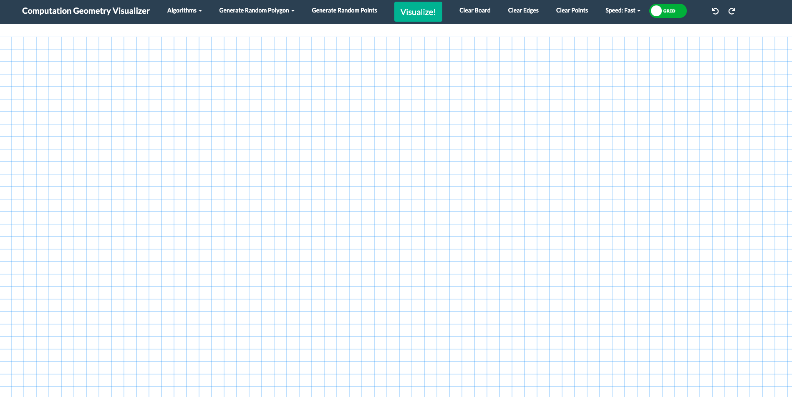
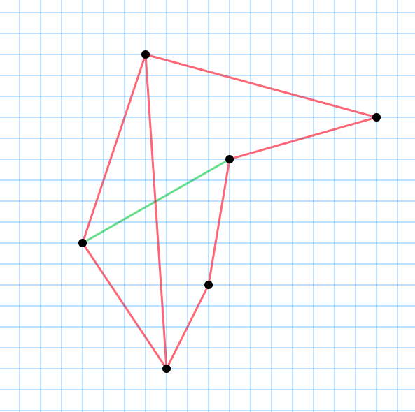

this is a visulaization project for computational geometry (Still in progress)

the goal is to visualize all the algorithms learned in computation geometry class.

### Some key functionalities implemented:
- callabrated coordiante system, able to plot at point grid accuratly
- designed data obejcts:
  - points
  - edges
  - transactions (for undo redo)
- designed undo-redo system (almost all actions taken by user can be undo and redo)

### the skeleton of the project:

### graph
the green line indicating the last drawn line, this makes undo and redo more clearly

